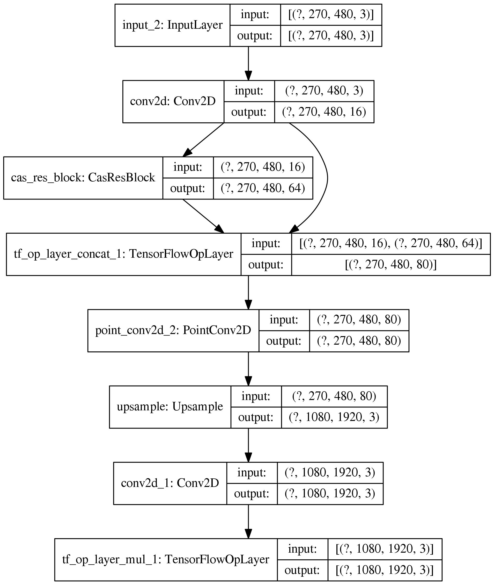

# CARN in Tensorflow
This is the implementation of an ECCV'18 paper, "Fast, Accurate, and Lightweight Super-Resolution with Cascading Residual Network" in Tensorflow [(link)](https://openaccess.thecvf.com/content_ECCV_2018/papers/Namhyuk_Ahn_Fast_Accurate_and_ECCV_2018_paper.pdf) 

For this implementation, I designed new layers and a model by subclassing, which was a good practice of this tensorflow code guide on 'Making new Layers and Models via subclassing'. [(link)](https://www.tensorflow.org/guide/keras/custom_layers_and_models)

## Prerequisite
- Language: Python3
- Required Packages: numpy, cv2 (for read image input), and tensorflow
- To install the required packages, type the following command:

1) Using tensorflow-gpu==2.0.0
```
pip3 install numpy opencv-python tensorflow-gpu==2.0.0
```

2) Using higher version of tensorflow
```
pip3 install numpy opencv-python tensorflow
```

## How to use the CARN model
By subclassing layers and models, we can easily design CARN model simply specifying a few parameters. 
- Parameters for CARN model:
1) initial_filter_num: represents the number of filters for the inital convolution layer
2) num_cas_block: represents the number of cascading blocks
3) num_res_block: represents the number of resnet blocks in a cascading block
4) num_conv_block: represents the number of convolution layer in a resnet block
5) kernel_size: represnets the size of kernel in a convolution layer
- In this implementation, tensorflow-gpu==2.0.0 is installed. If higher version of TF used, you can easily enable 'group convolution' in tf.keras.layers.Conv2D by setting 'groups' attribute to the number of groups you want 
- You can remove the last Conv2D layer as its functionality already exists in the upsample layer. 
- How to create the CARN model 
```
#Set the model parameters
initial_filter_num = 16
num_cas_block = 1
num_res_block = 2
num_conv_block = 2
kernel_size = 3

#Load your dataset
input = cv2.imread('output.jpg').astype(np.float32)
input_small = cv2.resize(input, None, fx = 1/4, fy = 1/4) / 255.

#Set the training parameters
epochs = 10
optimizer = tf.keras.optimizers.Adam(learning_rate = 1e-4)

#Set the model save path
save_path = 'model'
if not os.path.exists(save_path):
    os.makedirs(save_path)

model = CasResNet(initial_filter_num, num_cas_block, num_res_block, num_conv_block, kernel_size)
optimizer = tf.keras.optimizers.Adam(learning_rate = 1e-4)
model.compile(optimizer, loss = tf.keras.losses.MeanSquaredError())
model.fit(input_small[np.newaxis, ...], input[np.newaxis, ...], epochs = epochs)
model.build_graph().summary()
tf.keras.utils.plot_model(model.build_graph(), show_shapes=True, dpi=256)

model.save(save_path)

'''
model = tf.keras.models.load_model(save_path)
result = model(input_small[np.newaxis, ...])
print(result)
'''
```

- Model Structure


